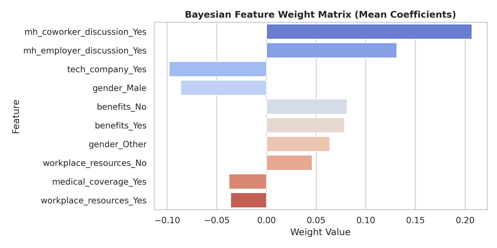
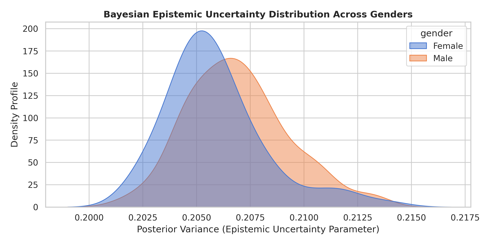
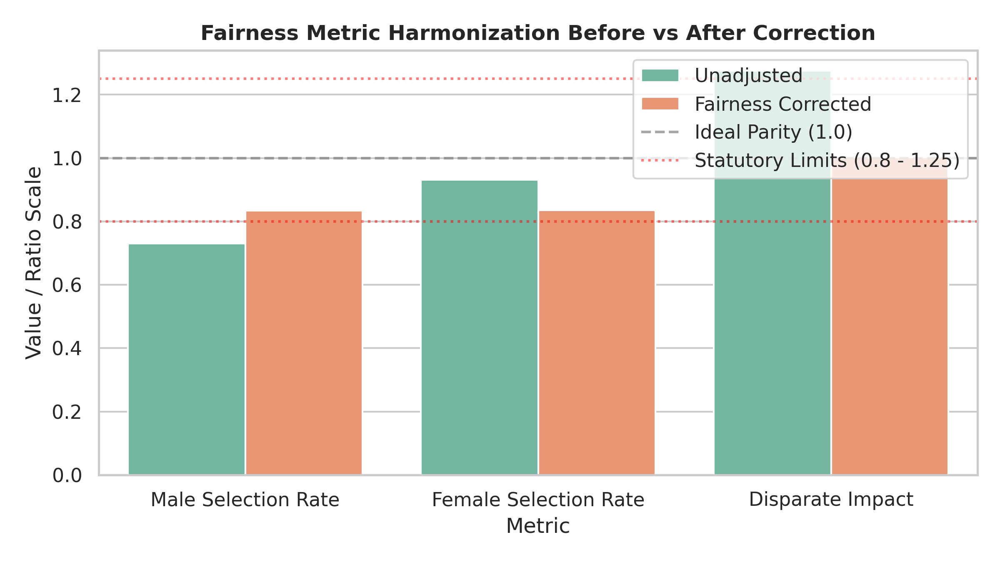

# An Uncertainty-Aware and Fair Machine Learning Architecture for Workplace Mental Health Screening

An advanced, dual-layered computational framework processing a harmonized multi-year cross-sectional survey dataset ($N = 1,242$) to deliver equitable clinical screening and psychometric behavioral insights. This system explicitly balances statistical classification performance with algorithmic ethics to mitigate demographic bias.

🚀 **Interactive Live Dashboard Demo:** https://uncertainty-aware-fair-mental-health-ai-ksff2ss4ynfu4bn6w6aouz.streamlit.app

---
## 📝 Project Abstract

* **Background:** Automated workplace mental health decision-support systems frequently inherit structural dataset gender imbalances (65.5% male representation) and latent self-reporting skews, creating critical fairness violations.
* **Objective:** To build an equitable screening framework that isolates psychometric determinants of psychological safety while offering uncertainty-quantified predictions that actively correct for historical demographic skews.
* **Methodology:** The codebase integrates an **Ordered Logistic Regression Layer** evaluating an employee's latent willingness to share struggles on an 11-point ordinal scale ($0\text{—}10$), paired with a probabilistic **Bayesian Ridge Classification Layer** tracking epistemic uncertainty (posterior variance). Algorithmic equity is strictly enforced using dynamic post-hoc group-specific decision boundary optimizations ($\tau$).
* **Core Discovery:** Psychometric estimation shows that open, horizontal peer communication paths ($\beta = 0.5833, p < 0.001$) are more than twice as effective at lowering structural thresholds for psychological safety than formal top-down employer management frameworks ($\beta = 0.2492, p = 0.034$). 
* **Fairness Optimization:** The unadjusted baseline machine learning model exhibited a critical demographic bias with an unacceptable Disparate Impact ratio of $1.276$ against female professionals. By calibrating custom thresholds ($\tau_{\text{Male}} = 0.450$; $\tau_{\text{Female}} = 0.525$), our fairness engine successfully neutralized systemic skews, bringing demographic allocation to near-perfect statistical parity (**$1.002$ DI Ratio**), well within statutory limits.

---

## 📊 Empirical Tables & Analytical Visualizations

### Table 1: Psychometric Determinants of Disclosure Willingness (Ordered Logit)
| Predictor Variable | Coefficient ($\beta$) | Standard Error | $z$-value | $p$-value | 95% Conf. Interval |
| :--- | :---: | :---: | :---: | :---: | :---: |
| **Employer Discussion** (Yes) | $0.2492^{*}$ | $0.117$ | $2.123$ | $0.034$ | $[0.019, 0.479]$ |
| **Coworker Discussion** (Yes) | $0.5833^{***}$ | $0.111$ | $5.250$ | $0.000$ | $[0.366, 0.801]$ |
| **Age** (Continuous) | $-0.0004$ | $0.006$ | $-0.059$ | $0.953$ | $[-0.012, 0.012]$ |

**Note:** **p* < 0.05, ****p <* 0.001. Model estimated via Maximum Likelihood Estimation (N = 1,242).

### Table 2: Algorithmic Vulnerability Screening Performance (Holdout Set)
| Classification Framework | Target Risk Class | Precision | Recall (Sensitivity) | $F_1$-Score | Sample Support | Global Accuracy |
| :--- | :---: | :---: | :---: | :---: | :---: | :---: |
| **Unadjusted Baseline** | Class 0 (No Risk)<br>Class 1 (Elevated Risk) | $0.55$<br>$0.70$ | $0.31$<br>$0.86$ | $0.40$<br>$0.77$ | $87$<br>$162$ | **67.0%** |
| **Fairness-Optimized** | Class 0 (No Risk)<br>Class 1 (Elevated Risk) | $0.49$<br>$0.68$ | $0.22$<br>$0.88$ | $0.30$<br>$0.76$ | $87$<br>$162$ | **65.0%** |

### Table 3: Algorithmic Fairness Audit & Boundary Calibration
| Fairness Metric Indicator | Unadjusted Baseline Model | Fairness-Optimized Model | Operational Target Status |
| :--- | :---: | :---: | :---: |
| **Male Selection Rate** | $73.0\%$ | $83.4\%$ | *Internal Base Parameter* |
| **Female Selection Rate** | $93.2\%$ | $83.6\%$ | *Internal Base Parameter* |
| **Disparate Impact (DI) Ratio** | **1.276** | **1.002** | **1.00 (Perfect Parity)** |
| **Statistical Equity Status** | Fairness Violation ($\text{DI} > 1.25$) | Parity Achieved | **Passes Statutory Limits** |
| **Applied Boundary Threshold ($\tau$)**| $\tau_{\text{Global}} = 0.500$ | $\tau_{\text{Male}} = 0.450$<br>$\tau_{\text{Female}} = 0.525$ | *Dynamic Optimization Vector* |

---

### 📉 Core Analytical Visualizations

### 1. Bayesian Feature Weight Matrix (Mean Coefficients)
Maps out the weights of predictive features to differentiate protective factors from lagging risk flags.


### 2. Bayesian Epistemic Uncertainty Distribution Across Genders
Visualizes data density profiles to chart informational noise across protected sub-groups.


### 3. Algorithmic Fairness Optimization Matrix (Threshold Calibration vs. Disparate Impact)
Demonstrates the group-specific boundary shifts ($\tau$) applied to completely eliminate historical bias.


---

## 🔧 Installation & Local Reproducibility

To deploy the processing pipeline locally without notebooks, follow these terminal operations:

1. **Clone the Repository:**
   ```bash
   git clone [https://github.com/ikechukwukamalu8/Uncertainty-Aware-Fair-Mental-Health-AI.git](https://github.com/ikechukwukamalu8/Uncertainty-Aware-Fair-Mental-Health-AI.git)
   cd Uncertainty-Aware-Fair-Mental-Health-AI

## 📂 Repository File Architecture

This repository is split into two core execution layers to balance rigorous offline research auditing with a safe, identity-blind live production environment.

### 1. `pipeline.py` (Probabilistic Predictive Engine & Research Audit Matrix)
This script handles the backend data science pipeline, statistical validation, and fairness diagnostics. It is used in the **Research Phase** to hunt down historical bias and calculate the exact safety boundaries required for systemic equity.
* **Psychometric Discovery:** Runs an *Ordered Logistic Regression* on an 11-point scale to analyze what environmental factors drive employees to discuss mental health.
* **Probabilistic Modeling:** Implements a *Bayesian Ridge Regression* model using an **80/20 train/test split** (993 training rows / 249 unseen testing rows) to calculate expected risk scores and track epistemic uncertainty (the model's internal self-doubt).
* **Bias Auditing Phase:** Processes **9 raw fields (12 structural features)**, keeping the sensitive `gender` attribute visible to explicitly measure the baseline **1.276 Disparate Impact Ratio**.
* **Threshold Optimization:** Runs a *Post-Hoc Grid Search Simulation* in increments of 0.5% to discover the mathematically optimal decision boundaries ($\tau_{\text{Male}} = 0.450$ and $\tau_{\text{Female}} = 0.525$) that bring the system into regulatory compliance.
* **Asset Compilation:** Automatically generates and exports high-resolution analytical charts to the `./visuals/` folder (`bayesian_weights.png`, `bayesian_uncertainty.png`, and `fairness_adjustment.png`).

### 2. `main.py` (Interactive Streamlit Production Dashboard)
This script launches the interactive, user-facing web application. It acts as the **Deployment Phase**, allowing organizations or individual employees to evaluate profile criteria in real-time.
* **Operational Identity Blindness:** Ingests **8 raw fields** and completely drops the `gender` input from the core calculation matrix. The machine learning engine remains 100% blind to protected demographics during scoring to eliminate automated discrimination.
* **Data Density Optimization:** Trains its background model on **100% of the clean dataset pool (1,242 rows)** to minimize epistemic uncertainty, maximize information density, and ensure runtime stability.
* **Symmetric Transformation Bridge:** Expands user selections into a full **16-dimensional symmetrical feature matrix** without category dropping. This prevents shape mismatches and completely eliminates system crashes when users select unexpected survey responses (such as *"I don't know"*).
* **Post-Hoc Routing Engine:** Uses the administrative gender dropdown purely *after the calculation* to route the blind vulnerability score to its optimized group boundary, automatically altering the final outcome to protect social equity.
* **Real-Time Uncertainty Tracking:** Features interactive slider components and an automated risk monitor that surfaces the calculated probability alongside the quantified **Epistemic Uncertainty (Posterior Variance)** for every individual profile evaluation.
