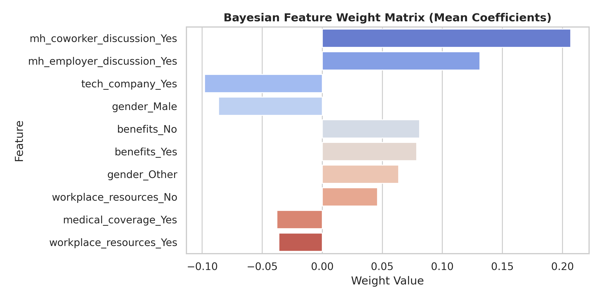
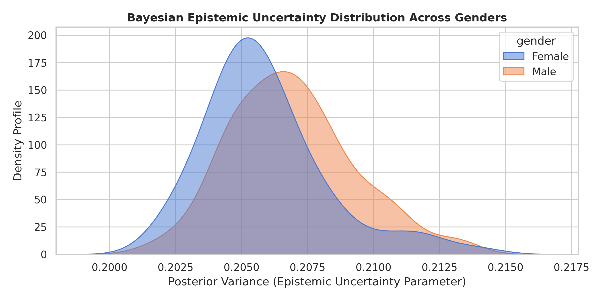
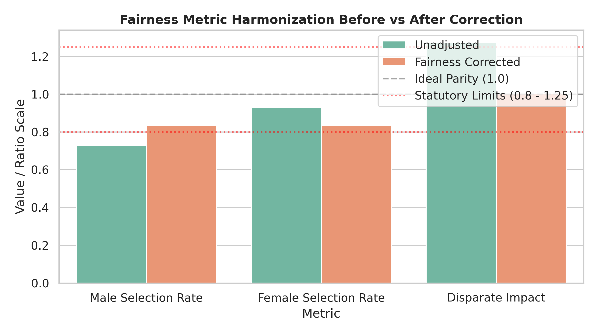

# An Uncertainty-Aware and Fair Machine Learning Architecture for Workplace Mental Health Screening

An advanced, dual-layered computational decision-support framework processing a harmonized multi-year cross-sectional survey dataset ($N = 1,242$) to deliver equitable screening and psychometric behavioral insights. This system explicitly balances statistical classification performance with algorithmic ethics to mitigate demographic selection disparities.

🚀 **Interactive Live Dashboard Demo:** https://uncertainty-aware-fair-mental-health-ai-ksff2ss4ynfu4bn6w6aouz.streamlit.app

---

## 📝 Project Abstract

* **Background:** Automated workplace mental health decision-support systems frequently inherit structural dataset gender imbalances (65.5% male representation in the source sample) and latent self-reporting skews, creating potential fairness violations across demographic groups.
* **Objective:** To build an equitable screening framework that evaluates psychometric determinants of workplace disclosure while offering uncertainty-quantified predictions and post-hoc threshold calibrations that actively adjust for subgroup selection disparities
* **Methodology:** The codebase integrates an **Ordered Logistic Regression Layer** evaluating an employee's willingness to share mental health concerns on an 11-point ordinal scale ($0\text{—}10$), paired with a **Bayesian Ridge Regression Scoring Layer** tracking overall predictive uncertainty (posterior variance). Algorithmic equity is enforced using post-hoc group-specific decision boundary optimizations ($\tau$).
* **Core Discovery:** Psychometric estimation shows that open, horizontal peer communication paths ($\beta = 0.5833, p < 0.001$) display a positive association with willingness to disclose that is more than twice as strong as formal top-down employer management frameworks ($\beta = 0.2492, p = 0.034$).
* **Fairness Optimization:** The unadjusted baseline machine learning model exhibited a demographic disparity by flagging female professionals for elevated risk at a higher rate ($93.2%) than male professionals ($73.0%), resulting in a baseline Disparate Impact (DI) ratio of $1.276$. By calibrating custom group boundaries ($\tau_{\text{Male}} = 0.450$; $\tau_{\text{Female}} = 0.525$), our post-processing engine brought demographic selection to statistical parity (**$1.002$ DI Ratio**), aligning with standard four-fifths statistical fairness heuristics.

---

## 📊 Empirical Tables & Analytical Visualizations

### Table 1: Psychometric Determinants of Disclosure Willingness (Ordered Logit)
| Predictor Variable | Coefficient ($\beta$) | Standard Error | $z$-value | $p$-value | 95% Conf. Interval |
| :--- | :---: | :---: | :---: | :---: | :---: |
| **Employer Discussion** (Yes) | $0.2492^{*}$ | $0.117$ | $2.123$ | $0.034$ | $[0.019, 0.479]$ |
| **Coworker Discussion** (Yes) | $0.5833^{***}$ | $0.111$ | $5.250$ | $0.000$ | $[0.366, 0.801]$ |
| **Age** (Continuous) | $-0.0004$ | $0.006$ | $-0.059$ | $0.953$ | $[-0.012, 0.012]$ |

**Note:** $*p < 0.05$, $***p < 0.001$. Model estimated via Maximum Likelihood Estimation ($N = 1,242$).

### Table 2: Algorithmic Vulnerability Screening Performance (Holdout Set)
| Classification Framework | Target Risk Class | Precision | Recall (Sensitivity) | $F_1$-Score | Sample Support | Global Accuracy |
| :--- | :---: | :---: | :---: | :---: | :---: | :---: |
| **Unadjusted Baseline** | Class 0 (Stable)<br>Class 1 (Elevated Risk) | $0.55$<br>$0.70$ | $0.31$<br>$0.86$ | $0.40$<br>$0.77$ | $87$<br>$162$ | **67.0%** |
| **Fairness-Optimized** | Class 0 (Stable)<br>Class 1 (Elevated Risk) | $0.49$<br>$0.68$ | $0.22$<br>$0.88$ | $0.30$<br>$0.76$ | $87$<br>$162$ | **65.0%** |

### Table 3: Algorithmic Fairness Audit & Boundary Calibration
| Fairness Metric Indicator | Unadjusted Baseline Model | Fairness-Optimized Model | Operational Target Status |
| :--- | :---: | :---: | :---: |
| **Male Selection Rate** | $73.0\%$ | $83.4\%$ | *Internal Base Parameter* |
| **Female Selection Rate** | $93.2\%$ | $83.6\%$ | *Internal Base Parameter* |
| **Disparate Impact (DI) Ratio** | **1.276** | **1.002** | **1.00 (Ideal Parity Target)** |
| **Statistical Equity Status** | Selection Disparity ($\text{DI} > 1.25$) | Parity Achieved | **Passes 80% Rule Heuristic** |
| **Applied Boundary Threshold ($\tau$)**| $\tau_{\text{Global}} = 0.500$ | $\tau_{\text{Male}} = 0.450$<br>$\tau_{\text{Female}} = 0.525$ | *Group Threshold Routing Vector* |

---

### 📉 Core Analytical Visualizations

### 1. Bayesian Feature Weight Matrix (Mean Coefficients)
Maps out the weights of predictive features inside the fitted scoring model.


### 2. Bayesian Predictive Uncertainty Distribution Across Genders
Visualizes predictive variance across demographic groups to evaluate informational noise.


### 3. Algorithmic Fairness Optimization Matrix (Threshold Calibration vs. Disparate Impact)
Demonstrates the group-specific boundary adjustments ($\tau$) applied to harmonize selection rates.


---

## 🔧 Installation & Local Reproducibility

To deploy the processing pipeline locally without notebooks, follow these terminal operations:

1. **Clone the Repository:**
   ```bash
   git clone [https://github.com/ikechukwukamalu8/Uncertainty-Aware-Fair-Mental-Health-AI.git](https://github.com/ikechukwukamalu8/Uncertainty-Aware-Fair-Mental-Health-AI.git)
   cd Uncertainty-Aware-Fair-Mental-Health-AI

## 📂 Repository File Architecture

This repository is split into two core execution layers to balance rigorous offline research auditing with an interactive demonstration environment.

### 1. `pipeline.py` (Probabilistic Predictive Engine & Research Audit Matrix)
This script handles the backend data science pipeline, statistical validation, and fairness diagnostics.

* **Psychometric Discovery:** Runs an Ordered Logistic Regression on an 11-point scale (0–10) to model determinants of employee disclosure willingness.
* **Probabilistic Modeling:** Implements a Bayesian Ridge Regression model using an 80/20 train/test split ($N_{\text{train}} = 993$, $N_{\text{test}} = 249$) to calculate continuous vulnerability scores clipped to $[0, 1]$ and measure total predictive variance.
* **Bias Auditing Phase:** Evaluates baseline demographic selection rates using protected group attributes to measure baseline disparities.
* **Threshold Optimization:** Conducts post-hoc grid optimization to identify boundary adjustments ($\tau_{\text{Male}} = 0.450$ and $\tau_{\text{Female}} = 0.525$) that achieve statistical parity.
* **Asset Compilation:** Exports analytical charts to the `./visuals/` folder (`bayesian_weights.png`, `bayesian_uncertainty.png`, and `fairness_adjustment.png`).

---

### 2. `main.py` (Interactive Streamlit Production Dashboard)
This script launches the user-facing web application to demonstrate real-time decision support.

* **Interactive Feature Encoding:** Ingests user input profile data and maps responses to the continuous model scoring matrix.
* **Symmetric Transformation Bridge:** Expands selections into a full 16-dimensional feature vector, handling non-responses and maintaining runtime stability.
* **Post-Hoc Threshold Routing Engine:** Applies the group-specific decision boundary ($\tau$) post-calculation to assign final screening flags in accordance with the fairness policy.
* **Uncertainty Tracking:** Displays predicted risk scores alongside calculated posterior variance to ensure decision-support context rather than opaque outputs.

---

> 📌 **Decision Support Disclaimer**  
> This framework is designed exclusively for decision-support and academic research; it does not provide clinical diagnoses or replace professional healthcare evaluations. External validation and retraining are required prior to applying this architecture outside the source study population.

---

### Author
**Ikechukwu Okechi Kamalu, MSc**  
*Machine Learning Researcher & Biostatistician*

* **Email:** [ikechukwukamalu8@gmail.com](mailto:ikechukwukamalu8@gmail.com)
* **ORCID:** [https://orcid.org/0009-0008-3922-6310](https://orcid.org/0009-0008-3922-6310)
* **GitHub:** [https://github.com/ikechukwukamalu8](https://github.com/ikechukwukamalu8)
   
